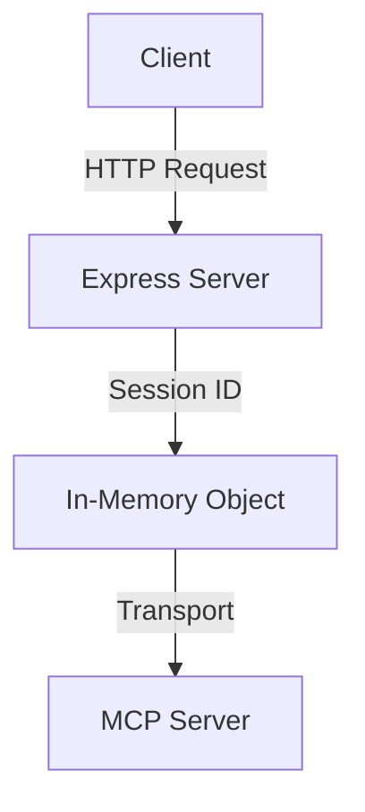
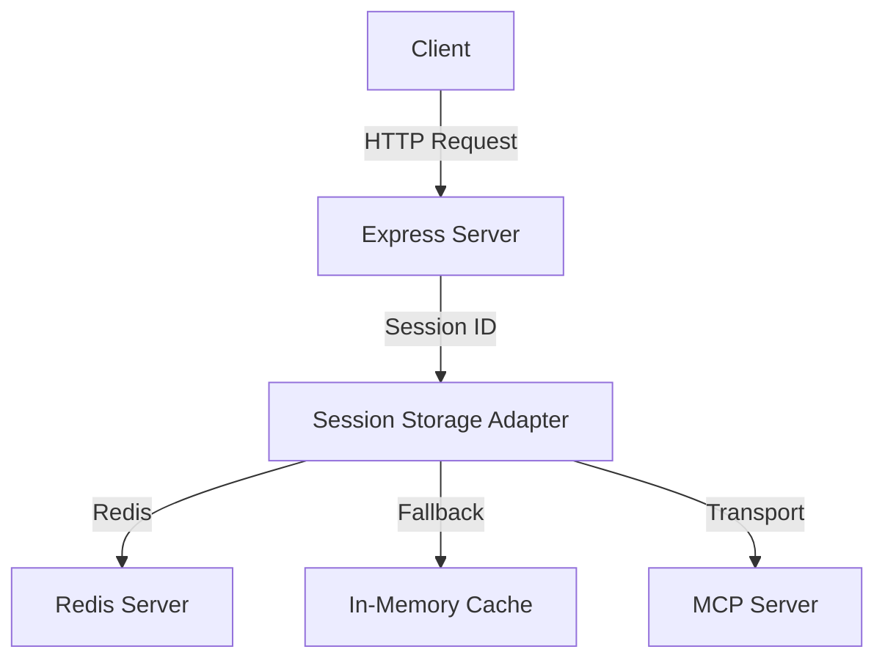

# Session Storage Design

## Architecture Overview

The session storage fix will introduce a configurable session storage layer that can use either Redis or in-memory storage, with Redis being the recommended production option.

### Current Architecture



### New Architecture



## Detailed Design

### 1. Session Storage Interface

```typescript
interface SessionStorage {
  // Store a session transport
  setSession(sessionId: string, transport: StreamableHTTPServerTransport): Promise<void>;
  
  // Retrieve a session transport
  getSession(sessionId: string): Promise<StreamableHTTPServerTransport | null>;
  
  // Remove a session (for cleanup)
  deleteSession(sessionId: string): Promise<void>;
  
  // Check if session exists
  hasSession(sessionId: string): Promise<boolean>;
}
```

### 2. Redis Session Storage Implementation

```typescript
class RedisSessionStorage implements SessionStorage {
  private readonly client: RedisClientType;
  private readonly prefix: string;
  
  constructor(redisUrl: string, prefix = 'mcp_session:') {
    this.client = createClient({ url: redisUrl });
    this.prefix = prefix;
    this.client.connect();
  }
  
  async setSession(sessionId: string, transport: StreamableHTTPServerTransport): Promise<void> {
    // Serialize transport (store minimal session data, not full transport)
    const sessionData = {
      sessionId: transport.sessionId,
      createdAt: new Date().toISOString(),
      // Store only essential session metadata
    };
    await this.client.set(`${this.prefix}${sessionId}`, JSON.stringify(sessionData), {
      EX: 24 * 60 * 60 // 24 hour TTL
    });
  }
  
  async getSession(sessionId: string): Promise<StreamableHTTPServerTransport | null> {
    const data = await this.client.get(`${this.prefix}${sessionId}`);
    if (!data) return null;
    
    const sessionData = JSON.parse(data);
    // Recreate transport or return cached instance
    return this.recreateTransport(sessionData);
  }
  
  async deleteSession(sessionId: string): Promise<void> {
    await this.client.del(`${this.prefix}${sessionId}`);
  }
  
  async hasSession(sessionId: string): Promise<boolean> {
    const exists = await this.client.exists(`${this.prefix}${sessionId}`);
    return exists === 1;
  }
  
  private recreateTransport(sessionData: any): StreamableHTTPServerTransport {
    // Logic to recreate transport from session data
    // This may need to cache active transports in memory for performance
  }
}
```

### 3. Memory Session Storage (Fallback)

```typescript
class MemorySessionStorage implements SessionStorage {
  private readonly sessions: Record<string, StreamableHTTPServerTransport> = {};
  
  async setSession(sessionId: string, transport: StreamableHTTPServerTransport): Promise<void> {
    this.sessions[sessionId] = transport;
  }
  
  async getSession(sessionId: string): Promise<StreamableHTTPServerTransport | null> {
    return this.sessions[sessionId] || null;
  }
  
  async deleteSession(sessionId: string): Promise<void> {
    delete this.sessions[sessionId];
  }
  
  async hasSession(sessionId: string): Promise<boolean> {
    return sessionId in this.sessions;
  }
}
```

### 4. Session Storage Factory

```typescript
function createSessionStorage(config: ServerConfig): SessionStorage {
  // Check for Redis configuration
  if (config.redisUrl) {
    console.log('🔧 Using Redis for session storage');
    return new RedisSessionStorage(config.redisUrl);
  }
  
  // Fallback to memory storage
  console.log('⚠️  Using in-memory session storage (sessions will not persist across restarts)');
  return new MemorySessionStorage();
}
```

### 5. Integration with Existing Code

The main change will be in `src/index.ts` around line 366:

**Before:**
```typescript
const transports: Record<string, StreamableHTTPServerTransport> = {};
```

**After:**
```typescript
// Initialize session storage
const sessionStorage = createSessionStorage(config);
```

And update the session handling logic:

**Before:**
```typescript
// Store transport for session reuse
const generatedSessionId = transport.sessionId;
if (generatedSessionId) {
  transports[generatedSessionId] = transport;
  res.setHeader('Mcp-Session-Id', generatedSessionId);
  console.error(`✓ New MCP session initialized: ${generatedSessionId}`);
}
```

**After:**
```typescript
// Store transport for session reuse
const generatedSessionId = transport.sessionId;
if (generatedSessionId) {
  await sessionStorage.setSession(generatedSessionId, transport);
  res.setHeader('Mcp-Session-Id', generatedSessionId);
  console.error(`✓ New MCP session initialized: ${generatedSessionId}`);
}
```

**Before:**
```typescript
} else if (sessionId && transports[sessionId]) {
  // Session-based request - reuse existing transport
  console.error(`✓ Reusing existing session: ${sessionId}`);
  const transport = transports[sessionId];
  await transport.handleRequest(req, res, req.method === 'POST' ? req.body : undefined);
```

**After:**
```typescript
} else if (sessionId && await sessionStorage.hasSession(sessionId)) {
  // Session-based request - reuse existing transport
  console.error(`✓ Reusing existing session: ${sessionId}`);
  const transport = await sessionStorage.getSession(sessionId);
  if (transport) {
    await transport.handleRequest(req, res, req.method === 'POST' ? req.body : undefined);
  }
```

## Configuration

Add to the server configuration:

```typescript
interface ServerConfig {
  // ... existing config
  redisUrl?: string; // e.g., 'redis://localhost:6379'
  sessionTtlSeconds?: number; // Default: 24 * 60 * 60 (24 hours)
}
```

Environment variables:
- `REDIS_URL`: Redis connection URL (optional)
- `SESSION_TTL_SECONDS`: Session time-to-live in seconds (default: 86400)

## Error Handling

1. **Redis connection failures**: Fall back to memory storage with warning
2. **Session serialization errors**: Log error and return 500
3. **Session not found**: Return 400 with clear error message
4. **Redis performance issues**: Implement circuit breaker pattern

## Performance Considerations

1. **Redis latency**: Should be <5ms for local Redis, <20ms for remote
2. **Session cache**: Consider adding LRU cache for frequently accessed sessions
3. **Serialization overhead**: Minimize data stored in Redis
4. **Connection pooling**: Use Redis connection pooling

## Security Considerations

1. **Session data**: Only store essential session metadata, not sensitive data
2. **Redis security**: Use Redis with authentication in production
3. **Session IDs**: Continue using UUID v4 for session IDs
4. **TTL**: Implement automatic session expiration

## Monitoring

Add logging for:
- Session creation success/failure
- Session reuse success/failure  
- Redis connection status
- Session storage performance metrics

## Migration Plan

1. **Phase 1**: Implement the new session storage with Redis support
2. **Phase 2**: Add configuration and make Redis optional
3. **Phase 3**: Test with both Redis and memory storage
4. **Phase 4**: Deploy with Redis enabled in production
5. **Phase 5**: Monitor and optimize performance

## Fallback Strategy

If Redis is unavailable:
1. Log warning message
2. Fall back to memory storage
3. Continue operating with reduced reliability
4. Alert monitoring systems

## Testing Strategy

1. **Unit tests**: Session storage interface implementations
2. **Integration tests**: Redis session persistence
3. **End-to-end tests**: Full session lifecycle
4. **Performance tests**: Benchmark Redis vs memory
5. **Failure tests**: Redis connection failures
6. **Compatibility tests**: Existing client behavior

## Dependencies

New production dependency:
- `redis`: ^4.6.0 (or compatible version)

## Files to Modify

1. `src/index.ts` - Main session handling logic
2. `src/config.ts` - Add Redis configuration
3. `src/session-storage.ts` - New session storage implementations
4. `package.json` - Add Redis dependency
5. Tests - Add session storage tests

## Estimated Effort

- Design: 2 hours ✅
- Implementation: 6-8 hours
- Testing: 4 hours
- Documentation: 1 hour
- Total: 13-15 hours